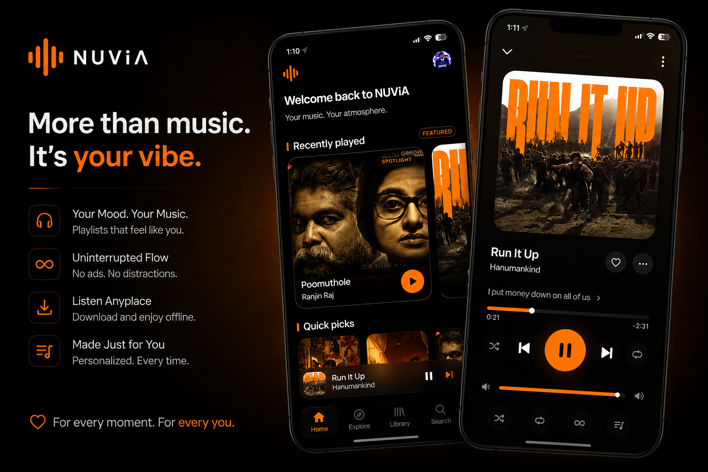
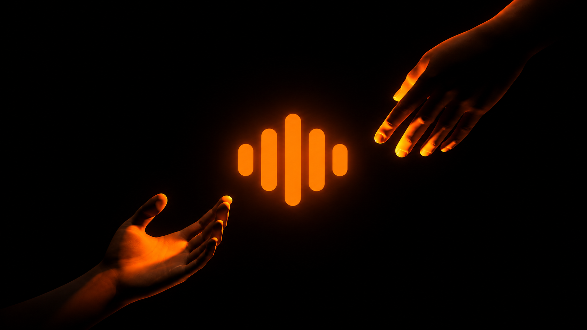

<div align="center">


# NUViA

### Your music. Your atmosphere. Your way.

A modern, open-source Android music player built with **Kotlin, Jetpack Compose, Media3, and native audio analysis** — designed around immersive playback, personal libraries, intelligent music experiences, and a premium Liquid Glass interface.

<p>
  
  
  
  
</p>

</div>

---

<div align="center">



</div>

---

## About NUViA

**NUViA** is an Android music player built around one idea:

> **Music should feel personal, not mechanical.**

NUViA brings local music, online music sources, playlists, downloads, lyrics, artwork-driven visuals, intelligent audio analysis, and a highly customizable interface into one listening experience.

Built with a modern Android stack, NUViA uses **Jetpack Compose** for its interface, **Media3 / ExoPlayer** for playback, and native DSP components for audio analysis.

Its interface is built around **Liquid Glass** — translucent surfaces, controlled blur, subtle reflections, soft depth, artwork-aware atmosphere, and motion designed around the music.

---

# Features

## Music & Playback

### Powerful playback

- **Media3 / ExoPlayer** — modern Android playback architecture.
- **Background playback** — continue listening while using other apps.
- **Queue management** — manage and control your current playback queue.
- **Shuffle & Repeat** — standard playback modes for different listening styles.
- **Autoplay** — continue discovering and playing music automatically.
- **Queue resilience** — handles playback/source failures and keeps the listening session moving where possible.
- **Crossfade** — smooth transitions between tracks where supported.
- **Seek controls** — precise playback seeking.
- **Next / Previous** — full playback navigation.
- **Mini Player** — persistent playback controls while browsing the app.
- **Now Playing** — dedicated full-screen listening experience.
- **Media session integration** — Android system and notification playback controls.
- **Audio quality controls** — source and stream quality handling where supported.
- **Caching** — local cache handling for smoother playback and reduced repeated network work.
- **Offline playback** — play supported downloaded and local content without an active connection.

---

## Music Sources & Discovery

NUViA is designed around multiple music sources instead of locking the entire experience to one provider.

### Supported music experiences

- **YouTube Music**
- **JioSaavn**
- **Local Music**
- **Search**
- **Home**
- **Explore**
- **Albums**
- **Artists**
- **Playlists**
- **Downloads**
- **Offline Library**
- **Source management**
- **Deep links**

Provider functionality can depend on the provider itself, authentication, network availability, regional restrictions, and changes made by third-party services.

---

# Your Library

NUViA treats your personal music library as a first-class part of the experience.

- **Reactive local music library**
- **Local Music browser**
- **Albums**
- **Artists**
- **Playlists**
- **Pinned playlists and content**
- **Downloads**
- **Offline content**
- **Search history**
- **Recently played / last-played state**
- **Library-aware playback**
- **Backup & Restore**

NUViA also retains compatibility with supported legacy user data so existing installations can continue recognizing older stored information.

---

# Lyrics

NUViA includes a dedicated lyrics ecosystem integrated into the listening experience.

### Lyrics capabilities

- Lyrics retrieval
- Lyrics display
- Embedded lyrics
- Enhanced/synchronized lyrics where available
- Multiple lyric-source handling
- Local lyric compatibility
- Embedded metadata lyric support
- Lyrics integrated into Now Playing

Legacy embedded lyric metadata is intentionally supported so existing music files can continue to expose lyrics when possible.

---

# Liquid Glass Experience

Liquid Glass is not just a single visual effect in NUViA.

It is the foundation of the interface.

### The design system includes

- Translucent surfaces
- Controlled blur
- Soft reflections
- Specular highlights
- Thin glass borders
- Artwork-aware ambient lighting
- Glass cards
- Glass controls
- Dynamic visual atmosphere
- Shared design tokens
- Reusable glass components
- Motion and transition primitives

The same visual language is used throughout the application so Home, Search, Library, Now Playing and Settings feel like parts of the same product.

---

# Artwork-Driven Atmosphere

Music should look different depending on what you're listening to.

NUViA can use the currently playing artwork to influence the surrounding visual atmosphere.

Album artwork can drive:

- Accent colors
- Ambient lighting
- Background atmosphere
- Visual emphasis
- Now Playing presentation

This creates a listening environment that changes with the music.

---

# Minimal Mode

For users who want a cleaner interface, NUViA includes **Minimal Mode**.

Minimal Mode reduces additional interface elements and keeps the experience focused on:

**music + artwork + essential controls.**

It is designed for a quieter, simpler listening experience without changing the underlying player.

---

# Now Playing

The Now Playing experience brings the core listening experience together in one place.

It can include:

- Album artwork
- Track information
- Playback controls
- Seek controls
- Queue access
- Lyrics
- Canvas
- Artwork-driven atmosphere
- Audio-aware visual elements
- Playback actions

---

# Mini Player

The persistent Mini Player lets you continue browsing while keeping the current track immediately accessible.

It provides quick access to:

- Current artwork
- Track information
- Play / pause
- Playback navigation
- Full Now Playing screen

---

# Canvas

NUViA supports Canvas-style visual content for supported music.

When available, visual content can become part of the Now Playing experience instead of leaving the user with a static playback screen.

---

# Smart Audio Analysis

NUViA contains a native and Kotlin-based audio-analysis system designed to understand music beyond basic metadata.

The analysis stack includes components for:

- **Beat tracking**
- **Tempo analysis**
- **Vocal analysis**
- **Mel-spectrogram generation**
- **Track feature extraction**
- **Transition planning**
- **Transition policy**
- **Audio resampling**
- **Native DSP analysis**

The Android layer communicates with the native analysis stack through JNI.

These systems provide the foundation for intelligent playback behavior, music-aware transitions, and future visual experiences.

---

# Downloads & Offline

NUViA includes a dedicated download and offline architecture.

### Download capabilities

- Download management
- Downloaded-track library
- Offline playback
- Cache-aware playback
- Metadata processing
- Artwork handling
- Local media discovery
- Audio file processing
- Legacy download-folder compatibility

Downloaded content can be managed separately from streaming content so your local collection remains accessible even when a network connection isn't available.

---

# Audio & Metadata

NUViA contains dedicated media-processing components for supported audio and container formats.

The project includes handling for:

- Media metadata
- FLAC tags
- MP4 tags
- WebM tags
- Embedded lyrics
- Artwork metadata
- Local media indexing
- Audio analysis

---

# Personalization

NUViA provides settings and controls for adapting the player to your preferences.

Depending on the current build, personalization areas include:

- Playback preferences
- Music-source configuration
- Account connections
- Download settings
- Lyrics settings
- Appearance
- Visual behavior
- Minimal UI preferences
- Developer options
- Diagnostics

---

# Account Connections

NUViA includes account-connection infrastructure for supported services.

Authentication is separated from the core local playback experience so your personal library and local playback aren't dependent on a single online account.

---

# Integrations

NUViA contains integration support for selected external services and Android platform functionality.

This includes areas such as:

- **Last.fm / Libre.fm**
- **ListenBrainz**
- **Discord Rich Presence**
- **Android media-session controls**
- **External-player handoff**
- **Deep links**
- **Android platform playback integration**

External integrations can require separate accounts, configuration, credentials, or provider availability.

---

# Backup & Restore

NUViA includes backup and restore infrastructure for supported application data.

The system is designed to preserve supported:

- Preferences
- Library-related information
- Playlists
- User configuration
- Other supported application state

Legacy backup recognition is retained where necessary for migration and compatibility.

---

# Developer & Diagnostics

NUViA includes developer-oriented tools for understanding and troubleshooting the application.

These include areas such as:

- Diagnostics
- Developer information
- Debug information
- Playback troubleshooting
- Source troubleshooting
- Native audio analysis
- Configuration inspection

---

# The NUViA Experience

<div align="center">



</div>

NUViA is built around the relationship between **music, atmosphere and interaction**.

The goal isn't to make another generic music player.

It's to make the entire listening experience feel connected — from the moment a track starts playing to the artwork, colors, controls, lyrics and atmosphere surrounding it.

---

# Architecture

NUViA is a single-module Android application built primarily with Kotlin and Jetpack Compose.

```text
NUViA/
├── app/
│   └── src/main/
│       ├── java/com/music/nuvia/
│       │   ├── playback/
│       │   ├── ui/
│       │   ├── data/
│       │   ├── downloads/
│       │   ├── lyrics/
│       │   └── ...
│       ├── cpp/
│       │   └── jni/
│       └── res/
│
├── native/
│   └── analyzer/
│
├── gradle/
├── Banner.png
├── bglogo.png
├── logo.png
├── orangelogo.png
├── handnuvia.png
├── LICENSE
└── README.md
```

### Core technologies

- **Kotlin**
- **Jetpack Compose**
- **Android SDK**
- **Media3 / ExoPlayer**
- **Gradle**
- **C++**
- **JNI**
- **Native DSP**
- **Android Media APIs**

---

# Build From Source

## Requirements

Install:

- Android Studio
- Android SDK
- JDK compatible with the project's Gradle/Android toolchain
- Git

## Clone

```bash
git clone https://github.com/aadhil06dev/NUViA.git
cd NUViA
```

Open the project in Android Studio and allow Gradle to synchronize.

## Build a debug APK

### Windows

```powershell
.\gradlew.bat assembleDebug
```

The generated APK will be available in the application's Gradle build output directory.

## Local configuration

Local Android configuration such as `local.properties` belongs on the developer machine and should not be committed.

Never commit:

- Signing keys
- Passwords
- API secrets
- Private credentials
- Local SDK configuration

---

# Project Status

NUViA is under active development.

The repository currently contains the Android application, playback architecture, music-source system, Liquid Glass UI foundation, local library and download infrastructure, lyrics system, native audio-analysis components, integrations, backup infrastructure and supporting Android functionality.

The project is continuously being refined for performance, stability and the final NUViA experience.

External integrations may change independently of NUViA because they depend on third-party services and infrastructure.

GitHub releases will be published separately when a specific distributable build has been prepared and verified.

---

# Support NUViA

NUViA is developed independently and is completely free to use.

If you enjoy NUViA and want to support continued development, you can optionally contribute.

<div align="center">

## Support Development


### Scan with Google Pay or another supported UPI app.

Every contribution helps support continued development, testing, infrastructure and future improvements to NUViA.

**Thank you for supporting NUViA.**

</div>

---

# Contributing

Contributions, bug reports, ideas and technical improvements are welcome.

Before opening a pull request:

1. Keep changes focused.
2. Avoid unrelated refactors.
3. Follow the existing Kotlin and Compose architecture.
4. Test affected functionality.
5. Do not commit secrets or local configuration.
6. Preserve required third-party attribution and licensing.
7. Explain significant architectural changes.

For larger changes, opening an issue first is recommended so the change can be discussed before implementation.

---

# Third-Party Software & Attribution

NUViA uses open-source libraries and upstream implementations under their respective licenses.

Required copyright notices, attribution and license terms are preserved in the relevant source files.

Parts of the audio-analysis system incorporate work originating from **Orchard**, and the applicable attribution and licensing notices are retained in the source tree.

See the relevant source files and [`LICENSE`](./LICENSE) for the applicable terms.

---

# License

NUViA is licensed under the:

**GNU General Public License v3.0**

See [`LICENSE`](./LICENSE) for the complete license text.

---

# Disclaimer

NUViA is provided as open-source software.

Music availability, metadata, lyrics, artwork, streaming services and external integrations may depend on third-party providers, their APIs, authentication requirements, regional availability and service changes.

NUViA does not claim ownership of third-party music, artwork, metadata or other copyrighted material accessed through supported services.

Users are responsible for using NUViA and connected services in accordance with applicable laws and the terms of those services.

---

# Credits

<div align="center">


### NUViA

**Created and developed by Adhil CLT.**

Built with Kotlin, Jetpack Compose, Media3/ExoPlayer, C++/JNI and open-source technologies.

</div>

---

<div align="center">

**NUViA**

*Your music. Your atmosphere. Your way.*

</div>